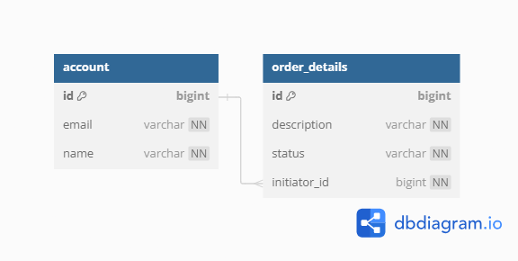

# springbootaopt1

### Описание проекта
Restfull API backend-сервис для размещения заказов пользователями.
Учебный проект по заданию от T1 образовательной школы по Java направлению.


#### Основные особенности проекта:
* Разработан с использованием фрэйворка Spring Boot 2.7.2
* Схема разделения данных по MVC
* 10 End-point доступных для управления данными


## Содержание:
1. [Техническое задание](#техническое-задание)
2. [Стэк проекта](#стэк-проекта)
3. [API сервиса](#api-сервиса)
4. [ER диаграмма](#er-диаграмма)
5. [Инструкция](#пошаговая-инструкция-по-установке-и-запуску-проета)
6. [Автор](#автор)


## Техническое задание
* [Тех-задание](src/main/resources/static/OpenSchool3.txt)


## Стэк проекта
Java 17, Spring Boot (Web, AOP, JPA, Test), Lombok, Slf4j, test Db H2


## API сервиса
#### User (Пользователи)
* POST /admin/users - Создать пользователя;
* PATCH /users/{userId} - Обновить пользователя;
* GET /users/{userId} - Получить пользователя;
* GET /users - Получить всех пользователей;
* DELETE /admin/users/{userId} - Удалить пользователя.

#### Order (Заказы)
* POST /users/{userId}/orders - Создать заказ;
* PATCH /users/{userId}/orders/{orderId} - Обновить информацию о заказе;
* GET /users/orders/{orderId} - Получить заказ;
* GET /users/orders - Получить все заказы;
* DELETE /admin/orders/{orderId} - Удалить заказ.

## ER диаграмма


## Пошаговая инструкция по установке и запуску проета
1. Установите Git: Если у вас еще не установлен Git, загрузите и установите его с официального сайта
   Git: https://git-scm.com/.
2. Клонируйте репозиторий: Откройте командную строку или терминал и выполните команду клонирования для репозитория
   GitHub. Например:

```
git clone https://github.com/KoryRunoMain/springbootaopt1.git
```

3. Откройте проект в IDE: Откройте вашу среду разработки (IDE), такую как IntelliJ IDEA, Eclipse или NetBeans.
4. Импортируйте проект как Maven проект: Если вы используете IntelliJ IDEA,
   выберите File -> Open и выберите папку, в которую был склонирован репозиторий.
   IntelliJ IDEA должна автоматически распознать проект как Maven проект и импортировать его.
   В Eclipse вы можете выбрать File -> Import -> Existing Maven Projects и выбрать корневую папку проекта.
   В NetBeans вы можете выбрать File -> Open Project и выбрать папку проекта.
5. Запустите приложение: точка входа находится в классе "SpringbootaopApplication" помеченном аннотацией
   @SpringBootApplication.
   Либо запустите через Maven:

```
mvn spring-boot:run
```

## Автор
* "KoryRunoMain"